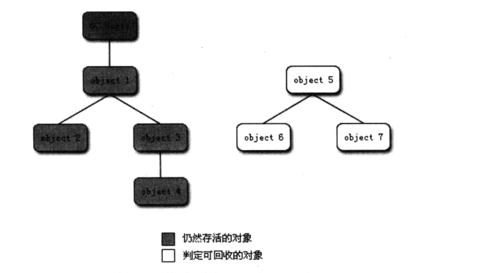

### 主要内容

- [ ] 概述
- [ ] 对象已死？
- [ ] 垃圾收集器算法

#### 概述

前面介绍了Java内存运行时区域的各个部分，其中程序计数器、虚拟机栈、本地方法栈三个区域随线程而生，随线程而灭，栈中的栈桢随着方法的进入和退出而有条不絮执行着出栈和入栈操作。每一个栈桢分配多少内存基本上是类结构确定下来时就已知的，尽管运行期由JIT编译器进行优化，因此这几个区域的内存分配和回收都举办确定性，在这几个区域不需要过多考虑内存回收问题。而<u>java堆和方法区</u>则不一样，一个接口多个实现类需要的内存不一样，一个方法中的多个分支需要的内存也不一样，只有在程序运行期间才知道会创建那些对象，这部分内存回收动态的

#### 对象是否存活

##### 引用计数算法

给对象中添加一个引用计数器，每当有一个地方引用它时，计数器值就减1，任何时刻计数器都为0的一些就是不可能在被使用的，客观地说，引用计数算法的实现简单，判定的效率也挺高，但是，java语言中没有选用引用计数算法来管理内存，其中最主要的原因时它很难结局是对象实现的相互引用问题

举个简单的例子，代码如下，对象ObjA和对象ObjB都有字段instance，赋值令objA.instance = objB及obj.instance=objA，除此之外，这两个对象在无任何引用，实际上这两个对象已经不肯在被访问，但是因为互相引用这对方，导致他们的引用计数都不为0，于是引用计数算法无法通知GC收集器回收他们

```java
public class ReferenceCountingGC {
    public Object instance=null;

    private static final int _1MB=1024*1024;

    /*
     这个成员属性的唯一意义就是占点内存，以便能在GC日志中看清楚是否被回收过
     */

    private byte[] bigSize = new byte[2 * _1MB];

    public static void main(String[] args) {
        ReferenceCountingGC.testGC();
    }
    public static void testGC(){
        ReferenceCountingGC objA = new ReferenceCountingGC();
        ReferenceCountingGC objB = new ReferenceCountingGC ();
        objA. instance = objB;
        objB.instance = objA;
        objA = null;
        objB = null;
        //假设在这行发生GC，那么objA和objB是否能被回收?
        System.gc ();
    }
}

```

运行结果

```java
[0.001s][warning][gc] -XX:+PrintGCDetails is deprecated. Will use -Xlog:gc* instead.
[0.006s][info   ][gc] Using G1
[0.006s][info   ][gc,init] Version: 17.0.8+9-LTS-211 (release)
[0.006s][info   ][gc,init] CPUs: 8 total, 8 available
[0.006s][info   ][gc,init] Memory: 8192M
[0.006s][info   ][gc,init] Large Page Support: Disabled
[0.006s][info   ][gc,init] NUMA Support: Disabled
[0.006s][info   ][gc,init] Compressed Oops: Enabled (Zero based)
[0.006s][info   ][gc,init] Heap Region Size: 1M
[0.006s][info   ][gc,init] Heap Min Capacity: 8M
[0.006s][info   ][gc,init] Heap Initial Capacity: 128M
[0.006s][info   ][gc,init] Heap Max Capacity: 2G
[0.006s][info   ][gc,init] Pre-touch: Disabled
[0.006s][info   ][gc,init] Parallel Workers: 8
[0.006s][info   ][gc,init] Concurrent Workers: 2
[0.006s][info   ][gc,init] Concurrent Refinement Workers: 8
[0.006s][info   ][gc,init] Periodic GC: Disabled
[0.010s][info   ][gc,metaspace] CDS archive(s) mapped at: [0x0000007000000000-0x0000007000be4000-0x0000007000be4000), size 12468224, SharedBaseAddress: 0x0000007000000000, ArchiveRelocationMode: 1.
[0.010s][info   ][gc,metaspace] Compressed class space mapped at: 0x0000007001000000-0x0000007041000000, reserved size: 1073741824
[0.010s][info   ][gc,metaspace] Narrow klass base: 0x0000007000000000, Narrow klass shift: 0, Narrow klass range: 0x100000000
[0.047s][info   ][gc,task     ] GC(0) Using 3 workers of 8 for full compaction
[0.047s][info   ][gc,start    ] GC(0) Pause Full (System.gc())
[0.047s][info   ][gc,phases,start] GC(0) Phase 1: Mark live objects
[0.048s][info   ][gc,phases      ] GC(0) Phase 1: Mark live objects 0.800ms
[0.048s][info   ][gc,phases,start] GC(0) Phase 2: Prepare for compaction
[0.048s][info   ][gc,phases      ] GC(0) Phase 2: Prepare for compaction 0.184ms
[0.048s][info   ][gc,phases,start] GC(0) Phase 3: Adjust pointers
[0.049s][info   ][gc,phases      ] GC(0) Phase 3: Adjust pointers 0.682ms
[0.049s][info   ][gc,phases,start] GC(0) Phase 4: Compact heap
[0.049s][info   ][gc,phases      ] GC(0) Phase 4: Compact heap 0.143ms
[0.050s][info   ][gc,heap        ] GC(0) Eden regions: 2->0(3)
[0.050s][info   ][gc,heap        ] GC(0) Survivor regions: 0->0(0)
[0.050s][info   ][gc,heap        ] GC(0) Old regions: 0->2
[0.050s][info   ][gc,heap        ] GC(0) Archive regions: 2->2
[0.050s][info   ][gc,heap        ] GC(0) Humongous regions: 6->0
[0.050s][info   ][gc,metaspace   ] GC(0) Metaspace: 404K(576K)->404K(576K) NonClass: 380K(448K)->380K(448K) Class: 23K(128K)->23K(128K)
[0.050s][info   ][gc             ] GC(0) Pause Full (System.gc()) 8M->1M(14M) 2.550ms
[0.050s][info   ][gc,cpu         ] GC(0) User=0.01s Sys=0.00s Real=0.00s
[0.051s][info   ][gc,heap,exit   ] Heap
[0.051s][info   ][gc,heap,exit   ]  garbage-first heap   total 14336K, used 1514K [0x0000000780000000, 0x0000000800000000)
[0.051s][info   ][gc,heap,exit   ]   region size 1024K, 1 young (1024K), 0 survivors (0K)
[0.051s][info   ][gc,heap,exit   ]  Metaspace       used 410K, committed 576K, reserved 1114112K
[0.051s][info   ][gc,heap,exit   ]   class space    used 24K, committed 128K, reserved 1048576K

```

以下是对日志中关键部分的解释：

1. **Deprecation Warning**:
   - `-XX:+PrintGCDetails is deprecated`: 表示`-XX:+PrintGCDetails`参数已被弃用，JVM将使用新的日志记录系统`-Xlog:gc*`代替。

2. **GC Initialization**:
   - `Using G1`: 表示JVM使用的是G1垃圾收集器。
   - `Version`: JVM的版本信息。
   - `CPUs`: 可用的CPU核心数。
   - `Memory`: 系统总内存。
   - `Large Page Support` 和 `NUMA Support`: 大页支持和非统一内存访问（NUMA）支持的状态。
   - `Compressed Oops`: 是否启用了对象指针压缩。
   - `Heap Region Size`: 堆区域大小。
   - `Heap Min/Initial/Max Capacity`: 堆的最小、初始和最大容量。

3. **Metaspace Initialization**:
   - `CDS archive`: 类数据共享（Class Data Sharing）存档信息。
   - `Compressed class space`: 压缩类空间的内存映射和保留大小。
   - `Narrow klass`: 有关对象头中类元数据压缩的信息。

4. **GC Event**:
   - `GC(0) Using 3 workers of 8 for full compaction`: 第0次GC使用3个工作线程进行全堆压缩。
   - `Pause Full (System.gc())`: 由`System.gc()`触发的全停顿GC。

5. **GC Phases**:
   - `Phase 1: Mark live objects`: 标记存活对象阶段。
   - `Phase 2: Prepare for compaction`: 准备压缩阶段。
   - `Phase 3: Adjust pointers`: 调整指针阶段。
   - `Phase 4: Compact heap`: 堆压缩阶段。

6. **GC Details**:
   - `Eden regions`: Eden区的使用情况，从2个区域减少到0，共有3个区域。
   - `Survivor regions`: Survivor区的使用情况，没有变化。
   - `Old regions`: Old区的使用情况，从0增加到2个区域。
   - `Archive regions`: 存档区的使用情况，没有变化。
   - `Humongous regions`: 大对象区域的使用情况，从6个区域减少到0。

7. **Metaspace Details**:
   - 显示了元空间的使用情况，包括非类空间（NonClass）和类空间（Class）的使用、提交和保留的大小。

8. **GC Summary**:
   - `Pause Full (System.gc()) 8M->1M(14M) 2.550ms`: GC前后的堆使用情况，从8MB减少到1MB，总共有14MB的堆，GC暂停时间为2.550毫秒。

9. **CPU Time**:
   - `User=0.01s Sys=0.00s Real=0.00s`: 用户时间、系统时间和实际时间，显示GC操作的持续时间。

10. **Heap at GC Exit**:
    - 显示了GC退出时的堆信息，包括总大小、已使用大小、区域大小、年轻代和元空间的使用情况。

总结来说，日志显示了JVM的启动信息、G1垃圾收集器的使用、堆和元空间的配置，以及一次由`System.gc()`触发的全堆压缩GC事件的详细过程和结果。这次GC有效地减少了堆的使用量，并且在短时间内完成。

从运行结果中可以清楚地看到GC日志中包含“4603K->210K”，意味着虚拟机并没 有因为这两个对象互相引用就不回收它们，这也从侧面说明虚拟机并不是通过引用计数 算法来判断对象是否存活的。

##### 根搜索算法

在主流的商用程序语言中(Java 和C#，甚至包括前面提到的古老的Lisp)，都是使 用 根 搜 索 算 法 (GCRootsTracing ) 判 定 对 象 是 否 存 活 的 。 这 个 算 法 的 基 本 思 路 就 是 通 过一系列的名为“GCRoots” 的对象作为起始点，从这些节点开始向下搜索，搜索所 走 过 的 路 径 称 为 引 用 链 (ReferenceChain)， 当 一个 对 象 到 GCRoots 没 有 任 何 引 用 链 相 连(用图论的话来说就是从GCRoots 到这个对象不可达)时，则证明此对象是不可用 的。如图3-1所示，对象object 5、object 6、object 7虽然互相有关联，但是它们到GC Roots 是不可达的，所以它们将会被判定为是可回收的对象。
在 Java 语 言 里 ， 可 作 为 GCRoots 的 对 象 包 括 下面 几 种 : 

- [ ] 虚拟机栈 (栈帧中的本地变量表)中的引用的对象。 
- [ ] 方法区中的类静态属性引用的对象。 
- [ ] 方法区中的常量引用的对象。
- [ ] 本地方法栈中JNI (即一般说的Native方法)的引用的对象



##### 在谈引用

无论是通过引用计数算法判断对象的引用数量，还是通过根搜索算法判断对象的引 用链是否可达，判定对象是否存活都与**“引用”** 有关。在JDK1.2之前，Java中的引用 的定义很传统:<u>如果reference 类型的数据中存储的数值代表的是另外一块内存的起始地址，就称这块内存代表着 一个引用</u>。这种定义很纯粹，但是太过狭隘，一个对象在这 种定义下只有被引用或者没有被引用两种状态，对于如何描述一些“ 食之无味，弃之可 惜”的对象就显得无能为力。<u>我们希望能描述这样一类对象 :当内存空间还足够时，则 能保留在内存之中;如果内存在进行垃圾收集后还是非常紧张，则可以抛弃这些对象</u>。 很多系统的缓存功能都符合这样的应用场景。

在 JDK1 . 2 之 后 ， Java 对 引 用 的 概 念 进 行 了 扩 充 ， 将 引 用 分 为 强 引 用 (Strong Reference)、 软 引 用 (SoftReference )、 弱 引 用 (WeakReference )、 虚 引 用 (PhantomReference )四种，这四种引用强度依次逐渐减弱。

- [ ] 强引用就是指在程序代码之中普遍存在的，类似“Objectobj=newObject()” 这 类的引用，只要强引用还存在，<u>垃圾收集器永远不会回收掉被引用的对象</u>。 
- [ ] 软引用用来描述一些还有用，但并非必需的对象。<u>对 于软引用关联着的对象，系统将要发生内存溢出异常之前，将会把这些对象列进回收范围之中并进行第二 次回收</u>。如果这次回收还是没有足够的内存，才会抛出内存溢出异常。在JDK 1.2 之后，提供了SoftReference类来实现软引用
- [ ] 弱引用也是用来描述非必需对象的，但是它的强度比软引用更弱一些，被弱引用 关 联 的 对 象 只 能 生 存 到 下 一次 垃 圾 收 集 发 生 之 前 。 <u>当 垃 圾 收 集 器 工 作 时 ， 无 论 当 前内存是否足够，都会回收掉只被弱引用关联的对象</u>。在JDK 1.2 之后，提供了W ea k R e f e r e n c e 类来 实 现 弱 引 用 
- [ ] 虚引用它是最弱的 一种引用关系。 一个对象是否 有虚引用的存在，<u>完全不会对其生存时间构成影响，也无法通过虚引用来取得 一 个对象实例</u>。为 一个对象设置虚引用关联的唯 一目的就是希望能在这个对象被收 集器回收时收到 一个系统通知。在JDK1.2之后，提供了PhantomReference类来 实现虚引用

##### 生存还是死亡

在根搜索算法中不可达的对象，也并非是“非死不可” 的，这时候它们暂时处于 **“缓刑”** 阶段，要<u>真正宣告 一个对象死亡，至少要经历两次标记过程:如果对象在进行 根搜索后发现没有与GCRoots相连接的引用链，那它将会被第 一次标记并且进行一次</u><u>筛选，筛选的条件是此对象是否有必要执行finalize 方法。当对象没有覆盖finalize() 方法，或者finalize(方法已经被虚拟机调用过，虚拟机将这两种情况都视为“没有必要 执行”</u>。如果这个对象被判定为有必要执行finalize ()方法，那么这个对象将会被放置在 一个 名为F -Queue 的队列之中，并在稍后由一条由虚拟机自动建立的、低优先级的Finaliz er 线程去执行。这里所谓的“执行” 是指虚拟机会触发这个方法，但并不承诺会等待它运 行结束。这样做的原因是，如果 一个对象在finalize(方法中执行缓慢，或者发生了死 循 环 (更 极 端 的 情 况 )， 将 很 可 能 会 导 致 F - Q u e u e 队 列 中 的 其 他 对 象 永 久 处 于等 待 状 态 ，
甚至导致整个内存回收系统崩溃。finalize (方法是对象逃脱死亡命运的最后一次机会， 稍后 G C将对F- Qu eue中的对象进行第二次小规模的标记，<u>如果对象要在finalize(中成</u>
<u>功拯救自己 ，只要重新与引用链 上的任何 一个对象建立关联即可，<u>譬如把自己 (this 关键字)赋值给某个类变量或对象的成员变量，那在第二次标记时它将被移除出“ 即将回收” 的集合</u>;如果对象这时候还没有逃脱，那它就真的离死不远了。从下面代码中 中我们可以看到 一个对象的finalize()被执行，但是它仍然可以存活。

```java
public class FinalizeEscapeGC {
    public static FinalizeEscapeGC SAVE_HOOK = null;

    public void isAlive() {
        System.out.println("yes, i am still alive :) ");
    }
/*
    finalize()方法通常用于在对象被垃圾收集前进行清理工作
     */
    @Override
    protected void finalize() throws Throwable {
        super.finalize();
        System.out.println("finalize mehtod executed!");
        FinalizeEscapeGC.SAVE_HOOK = this;
    }

    public static void main(String[] args) throws InterruptedException {
        SAVE_HOOK=new FinalizeEscapeGC();
        // 对象第一次拯救自己
        SAVE_HOOK=null;
        System.gc();
        // 因为Finalize方法优先级很低，暂停0.5秒，以等待它
        Thread.sleep(500);
        if(SAVE_HOOK!=null){
            SAVE_HOOK.isAlive();
        }else {
            System.out.println("no,i am dead");
        }
        SAVE_HOOK=null;
        System.gc();
        // 因为Finalize方法优先级很低，暂停0.5秒，以等待它
        Thread.sleep(500);
        if(SAVE_HOOK!=null){
            SAVE_HOOK.isAlive();
        }else {
            System.out.println("no,i am dead");
        }
    }
}
运行结果
finalize mehtod executed!
yes, i am still alive :) 
no,i am dead
```

代码运行结果可以看到，SAVE_HOOK对象的finalizeO方法确实被 G C 收 集 器 触 发 过 ， 并 且 在 被 收 集 前 成 功 逃 脱 了。
另外 一个值得注意的地方就是，代码中有两段完全 一样的代码片段，**执行结果却是 一次逃脱成功， 一次失败，这是因为任何 一个对象的finalize(方法都只会被系统自动调 用 一次，如果对象面临下一次回收，它的finalize(方法不会被再次执行，因此第 二段代 码的自救行动失败 了**。 需要特别说明的是，上面关于对象死亡时finalize()方法的描述可能带有悲情的艺术 色彩，笔者并不鼓励大家使用这种方法来拯救对象。相反，笔者建议大家尽量避免使用 它 ， 因 为 它 不 是 C / C + + 中 的 析 构 函 数 ， 而 是 J ava 刚 诞 生 时 为 了使 C / C + + 程 序 员 更 容 易 接受它所做出的 一个妥协。它的运行代价高昂，不确定性大，无法保证各个对象的调用 顺序。有些教材中提到它适合做“关闭外部资源” 之类的工作，这完全是对这种方法的 用途的 一种自我安慰。finalize()能做的所有工作，使用try-finally或其他方式都可以做 得更好、更及时，大家完全可以忘掉Java 语言中还有这个方法的存在。

##### 回收方法区

很多人认为方法区 (或者HotSpot虚拟机中的永久代)是没有垃圾收集的，Java虚 拟机规范中确实说过可以不要求虚拟机在方法区实现垃圾收集，而且在方法区进行垃圾 收集的 “性价比” 一般比较低:在堆中，尤其是在新生代中，常规应用进行一次垃圾收集一般可以回收70%~ 95%的空间，而永久代的垃圾收集效率远低于此。 **永久代的垃圾收集主要回收两部分内容:废弃常量和无用的类**。回收废弃常量 与 回 收Java 堆 中 的 对 象 非 常 类 似 。 以 常 量 池 中 字面 量 的 回 收 为 例 ， 假 如 一 个 字 符 串 “abc” 已经进入了常量池中，但是当前系统没有任何一个String对象是叫做“abc” 的，换句话说是没有任何String 对象引用常量池中的“abe” 常量，也没有其他地方 引用了这个字面量，如果在这时候发生内存回收，而且必要的话，这个“abc” 常量 就会被系统“请” 出常量池。常量池中的其他类(接口)、方法、字段的符号引用也 与此类似。
判定一个常量是否是“废弃常量” 比较简单，而要判定一个类是否是“ 无用的类” 的条件则相对苛刻许多。类需要同时满足下面3 个条件才能算是“ 无用的类” :

- [ ] 该类所有的实例都已经被回收，也就是Java堆中不存在该类的任何实例。

- [ ] 加 载 该 类的 C l a s s L o a d e r 已 经 被 回收 。

- [ ] 该类对应的java.lang.Class 对象没有在任何地方被引用，无法在任何地方通过反射访问该类的方法。

- [ ] 虚拟机可以对满足上述3 个条件的无用类进行回收，这里说的仅仅是“ 可以”，而 不是和对象 一样，不使用了就必然会回收。是否对类进行回收，HotSpot 虚拟机提供 了 - X noclassge 参 数 进 行 控 制 ， 还 可 以 使 用 -verbose : class 及 - X X :+ TraceClassL oading 、 - X X :+TraceClassUnLoading 查 看 类 的 加 载 和 卸 载 信 息 。 -verbore : class 和 - X X : +TraceClassLoading 可以在Product 版的虚拟机中使用，但是-XX:+TraceClassLoa ding 参数需要f ast dcbug 版的虚拟机支持。

  在大量使用反射、动态代理、CGLi b 等bytecode 框架的场景，以及动态生成JSP 和 OSGi <u>这类频繁自定义ClassLoader 的场景都需要虚拟机具备类卸载的功能，以保证永久 代不会溢出。</u>

#### 垃圾收集算法

